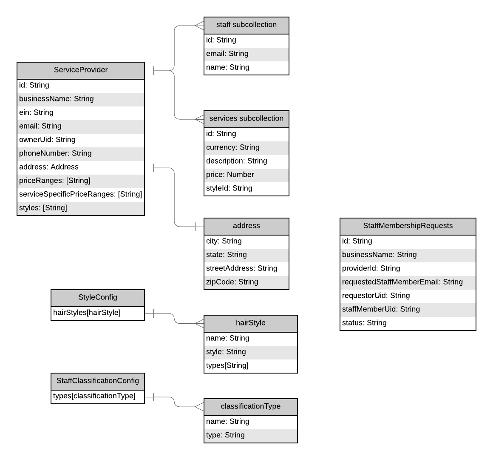

# provider-services

This repo contains a set of deployable services to handle BookIt Service Provider Operations. This includes creating and managing service providers, staff members, services, and staff member requests. The repo is designed as a mono-repo to house all services necessary to support the functions related to ServiceProviders as it has been defined for the BookIt app. Each service is intended to be individually deployed as a standalone microservice to the cloud to be consumed by the client applications.

## Content

- [High Level Architecture](#High-Level-Architecture)
- [Design](#Design)
- [Data Model](#Data-Model)
- [REST APIs](#REST-APIs)
- [Repo Organization](#Repository-Organization)
- [Code Quality](#Code-Quality)

## High Level Architecture

The overall design of the services is based on the layering shown in the above diagram. There is an express server which exposes routes accessible via HTTP. Each route has a set of Business logic attached which are defined as express MW allowing the logic to be re-used where appropriate and decomposed/isolated with clear separation of concerns. Finally there is a data access layer defined as the Repository layer where all interactions with the underlying storage technology is abstracted.

## Design

The design is based around how [expressjs](https://expressjs.com) works and hence everything is essentially decomposed down into a setup of middleware. The following diagram shows the basic flow of execution within the services.

For details on the individual services and components of the diagram refer to the following:

- Component Descriptions
  - [Shared lib](./src/lib/README.md)
  - [Configuration Service](./src/services/configuration-service/README.md)
  - [Create Service Offering](./src/services/create-service-offering/README.md)
  - [Create Service Provider](./src/services/create-service-provider/README.md)
  - [Delete Service Provider](./src/services/delete-service-provider/README.md)
  - [Offering Notification Processor]()
  - [Provider Delete Notification Processor]()
  - [Provider Search]()
  - [Query Service Provider]()
  - [Staff Membership Accepted Notification]()
  - [Staff Membership Request]()
  - [Staff Membership Request Query]()
  - [Staff membership Request Update]()
  - [Update Service Offering]()
  - [Update Service Provider]()

## Data Model

The data model supporting the service provider set of services is represented in the diagram above and the collections are stored within Cloud Firestore. All of the services within this repo work with this underlying data model and operate are different parts/subsets of the data depending on the services responsibility. The below provides details related to the purpose of the collection.

- Service Provider Collection: This collection contains documents pertaining to the Service Provider Master Data

  - Staff sub-collection: This sub-collection under the ServiceProvider collection contains information related to on-boarded staff members for the provider
  - Offering sub-collection: This sub-collection under the ServiceProvider collection contains the details about the services which the provider is able to make available for their potential clients.

- StaffMembershipRequests Collection

- config collection

## REST APIs

Each service depicted in the design diagram exposes HTTP(s) REST APIs to be consumed by either the client application, other internal Google Cloud Services, or for service to service internal API communication. The requests that are exposes are mentioned below Refer to the [API Gateway Repo](https://github.com/bookit-app/api-gateway) OpenAPI specification for the APIs which are exposes and consumed from the client application.

## Repository Organization

As these services are all implemented in nodejs npm is used to manage the dependencies. However, as this is a mono-repo and contains several microservice applications that will be deployed as docker containers it has been designed in a away to allow each service to be built into a container containing only the necessary dependencies that it specifically requires. This is done to try and keep the image size to a minimum. Dependencies are managed as follows:

- **Global Dependencies**: There are dependencies that every service leverages. These have been defined in the `package.json` at the root of the project and each service leverages them as this ensures consistency across the deployments as well as ensures that shared libraries leverage the same versions across all.
- **Local Dependencies**: These are dependencies specific to an individual service and would only be contained within the deployment. These are managed within the `package.json` file within the services directory under src/service/<service-name>.

## Code Quality

The following practices were put in place to ensure high quality code is delivered:

- Integration with husky inorder to verify what is being pushed and committed to github. Husky is a tool that plugs into local git hooks and we leverage it for processing verifications as pre-commit hooks. For the provider-services hooks are in place to ensure for unit-tests pass, code coverage is acceptable, and linting is enforced (code syntax, formatting, etc) on commit. The settings are defined within the main [package.json](./package.json)

- We have enforced a code review processing within github using the Pull Request process. When pull requests are opened the following occurs:
  - Integration with [Coveralls](https://coveralls.io/github/bookit-app/provider-services?branch=master) to track unit test code coverage over time to ensure we can tracking well with our implemented unit tests - Also see badge linked at the top of the repo
  - Integration with [Codacy](https://www.codacy.com/gh/bookit-app/provider-services?utm_source=github.com&utm_medium=referral&utm_content=bookit-app/provider-services&utm_campaign=Badge_Grade) which is a code quality tool and provides insights in to overall code quality based on a scoring metric, analyzes complexity, technical debt, formatting issues and so one. - Also see badge linked at the top of the repo
  - Build validation is performed where linting, and unit tests are executed agin to ensure everything is still passing
  - If the above checks do not meet standards set for the project and pass than the pull request cannot be merged into the master branch. This alleviates that we have undesirable code being merged onto the master branch and deployed to the production landscape
