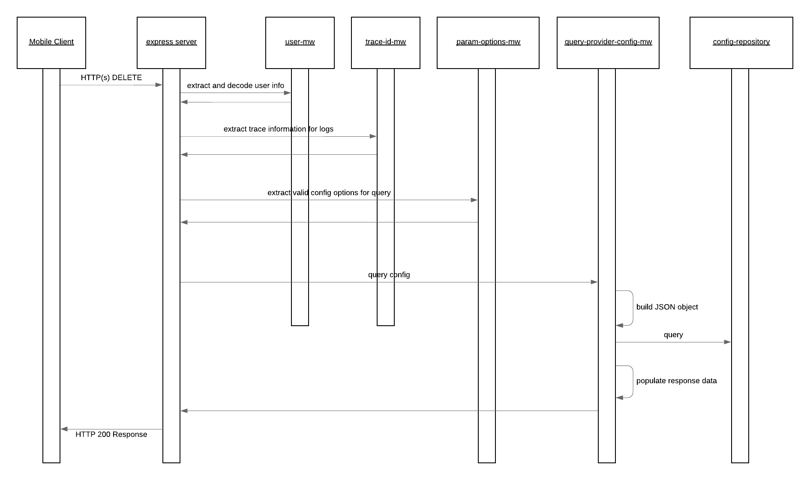

# configuration-service

The configuration service provides a means to expose configuration options as they pertain to the Service Provider. The supported configurations built for the Bookit App relate to:

- staffClassification: Defines the role a staff member has within a ServiceProvider
- styles: Defines the globally supported service styles which are enabled by the book it app. These are used against queries and appointment booking however service providers are not limited to only these styles they can defined CUSTOM ones as they see fit it will just not be possible to search based on these.

The happy path sequence for this services POST request is seen in the below image. It is possible for the middleware or repositories to generate runtime exceptions in which case these are automatically captured and propagated to the user by the default configured express error MW handler. The possible error scenarios are mentioned in the component descriptions and would lead to a stop within the processing flow.

## API Description

This service exposes and HTTP(s) POST API which enables the creation of service proviers.

- [Payload](./src/payload-validations.js): This defines the expected payload for this service
- [Route](./src/index.js): The route which is directly exposed by this service is defined when the express POST route is registered.
- [StaffClassification: API Gateway Documentation](https://endpointsportal.bookit-app-260021.cloud.goog/docs/esp-fjwomrdjca-ue.a.run.app/0/routes/configuration/staffClassification/get): The API tools provides the documentation for the API as it is exposed via Cloud Endpoints to the outside world. 
- [Styles: API Gateway Documentation](https://endpointsportal.bookit-app-260021.cloud.goog/docs/esp-fjwomrdjca-ue.a.run.app/0/routes/configuration/styles/get): The API tools provides the documentation for the API as it is exposed via Cloud Endpoints to the outside world. 

## Component Descriptions

The configuration service exposes a route to **GET** the set of configuration properties as specified above. When a request is received it will trigger a set of express MW and determine what to do. The service exposes the route at `/configuration/:config` where the `:config` is the name specified above and enables the application to support any additional configuration that might need to be added in future iterations. This route is configured with the middleware as described within the [configuration-service index.js](./src/index.js) file.

- [param-options-mw.js](./src/param-options-mw.js): Converts the `:config` path parameter to camel case and stores it into the configQueryOptions req object if it is a supported option for the application.
- [query-provider-config-mw.js](./src/query-provider-config-mw.js)**: Triggers the request to the repository and processes/prepares the result for the consumer of the REST API
