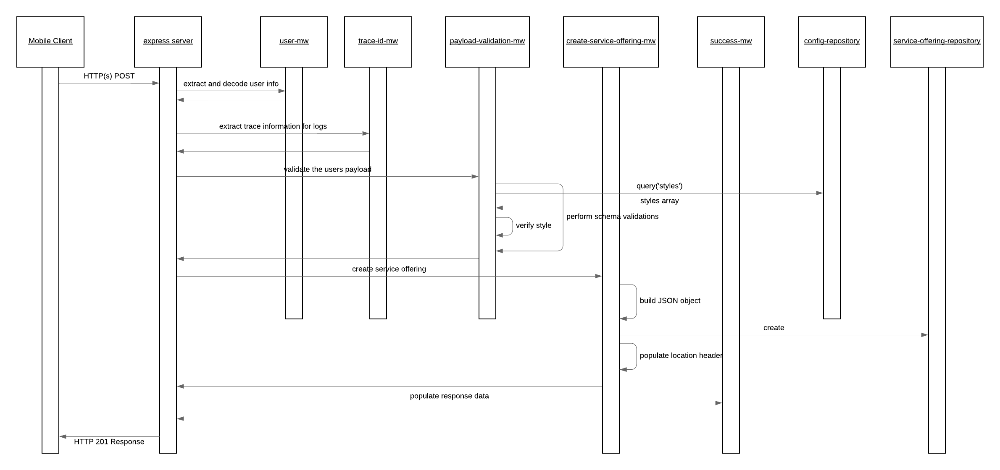
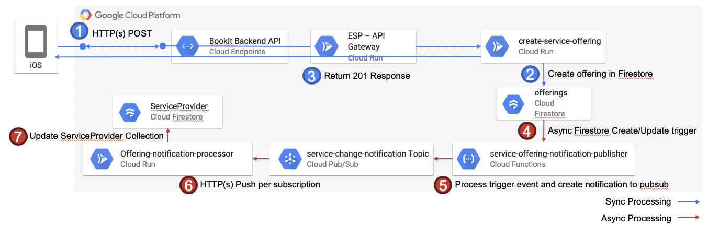

# create-service-offering

The create service offering service provides the capabilities to publish service offerings against a service provider. When a service offering is published the data is validated against the defined schema and if acceptable the information is created within the offerings sub-collection associated with the service provider.

The happy path sequence for this services request is seen in the below image. It is possible for the middleware or repositories to generate runtime exceptions in which case these are automatically captured and propagated to the user by the default configured express error MW handler. The possible error scenarios are mentioned in the component descriptions and would lead to a stop within the processing flow.

## Component Descriptions

- [create-service-offering-mw](./src/create-service-offering-mw.js): This is the main MW step configured for this service within the chain and it is responsible to take the payload provided by the user and map it to an object which is acceptable for the service offering repository to commit to the database.

  - Error Scenarios:
    - Update Failed Error: This is raised when an exception is generated from the repository. This would occur if there are failures with the creation of the service offering.

- [payload-validations](./src/payload-validations.js): This defines the schema which is expected for the body of the payload and some check functions to ensure the provided data is appropriate.

  - Error Scenarios:
    - Malformed Error: When the provided payload is not valid per the schema defined.

- [success-mw](./src/success-mw.js): If all goes well within the process and this MW step is reached it is just populating a proper HTTP response code to the caller.

## Special Processing

Creation of service offerings has some special processing which occurs after the information is created within the offerings sub-collection. The flow is depicted in the flow diagram below.

The information related to service offerings is necessary to enabling the defined search capabilities for service providers, specifically the pricing and the service types. In order to do the searching arrays are populated on the main ServiceProvider collection to help allow the queries to be efficient considering data from these sub-collection documents. As the ability to search for the data is not a critical part of creating service offerings the handling and sync of the related information is pushed to the background. This enables the user to receive quicker responses with respect to creating offerings, and it is also keeps the logic and the architecture clean as we have a clear separation of concerns between creating service offerings and enabling them to be searchable within our basic approach. This decoupled also enables us to enhance/modify the search capabilities and how we handle this at anytime with no impact to the services responsible for creating offerings.

The below describes what is happening as shown in the diagram

1. User sends and HTTP(s) POST request to create a new service offering.
2. When the service determines that the data is all valid it allows the creation of the offering into the offering collection on cloud firestore.
3. On successful creation of the document the create-service-offering service responds to the user with a 201 HTTP Created response code.
4. The service-offering-notification-publisher function is registered already within the infrastructure to the Create and Update firestore event triggers therefore when the data is saved these triggers are automatically fired behind the scenes. This is not within the same roundtrip as the user request.
5. The service-offering-notification-publisher receives the delta event message and generates the payload for the pubsub notification onto topic service-change-notification
6. The offering-notification-processor service is subscribed to this topic and will receive a push notification to process the message.
7. The offering notification processor service processes the message and stores the necessary data to cloud firestore on the ServiceProvider collection document.

Once the above process is completed the provider details will be returned within the queries which include details of the service offering like Price or Style.

### Additional Github Repositories

The below repositories contain the code base and documentation for those additional components mentioned within the data flow diagram above.

- [Service Offering Notification Publisher](https://github.com/bookit-app/service-offering-notification-publisher)
- [Service Provider Search](https://github.com/bookit-app/provider-services/tree/master/src/services/provider-search)
- Subscribers:
  - [Offering Notification Processor](https://github.com/bookit-app/provider-services/tree/master/src/services/offering-notification-processor)
