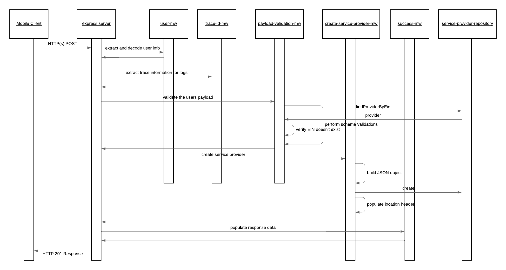
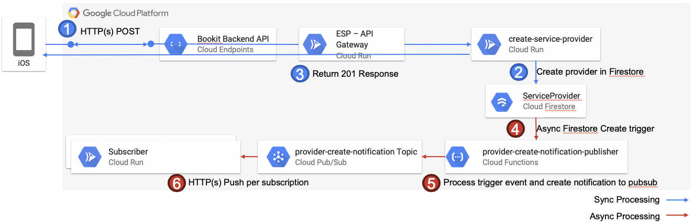

# create-service-provider

The create service provider service provides the capabilities to post a service provider for a particular user to register the business with the Bookit Application. When a service provider is published the data is validated against the defined schema and if acceptable the information is created within the ServiceProvider collection in the Cloud Firestore database.

The happy path sequence for this services POST request is seen in the below image. It is possible for the middleware or repositories to generate runtime exceptions in which case these are automatically captured and propagated to the user by the default configured express error MW handler. The possible error scenarios are mentioned in the component descriptions and would lead to a stop within the processing flow.

## Component Descriptions

- [create-service-provider-mw](./src/create-service-provider-mw.js): This is the main MW step configured for this service within the chain and it is responsible to take the payload provided by the user and map it to an object which is acceptable for the service provider repository to commit to the database.

  - Error Scenarios:
    - Update Failed Error: This is raised when an exception is generated from the repository. This would occur if there are failures with the creation of the service provider.

- [payload-validations](./src/payload-validations.js): This defines the schema which is expected for the body of the payload and some check functions to ensure the provided data is appropriate.

  - Error Scenarios:
    - Malformed Error: When the provided payload is not valid per the schema defined. This could occur if the JSON content on the body is malformed or the EIN code provided already exists against a ServiceProvider record

- [success-mw](./src/success-mw.js): If all goes well within the process and this MW step is reached it is just populating a proper HTTP response code to the caller.

## Special Processing

Creation of service providers has some special processing which occurs after the information is created within the ServiceProvider collection. The flow is depicted in the flow diagram below.

When a new service provider is created it is necessary to perform additional tasks, for example flag on the users profile that they are associated with and represent the owner of the service provider. There may be other services in future which would be interested in such events as well. Rather than mixing the processing within the create of the service provider it is done asynchronously and triggered based on events raised from the Cloud Firestore database as seen in the image above.

The below describes what is happening as shown in the diagram

1. User sends and HTTP(s) POST request to create a new service provider.
2. When the service determines that the data is all valid it allows the creation of the provider into the ServiceProvider collection on cloud firestore.
3. On successful creation of the document the create-service-provider service responds to the user with a 201 HTTP Created response code.
4. The provider-create-notification-publisher function is registered already within the infrastructure to the Create firestore event trigger for the ServiceProvider collection. When the data is saved the trigger is automatically fired behind the scenes. This is not within the same roundtrip as the user request.
5. The provider-create-notification-publisher receives the event message and generates the payload for the pubsub notification onto topic provider-create-notification
6. Those services which are registered as subscribers of this topic will receive the event notification and perform whatever dependent processing

### Additional Github Repositories

The below repositories contain the code base and documentation for those additional components mentioned within the data flow diagram above.

- [Provider Create Notification Publisher](https://github.com/bookit-app/provider-create-notification-publisher)
- Subscribers:
  - [Provider Create Notification Processor](https://github.com/bookit-app/profile-services/tree/master/src/services/provider-create-notification-processor)
