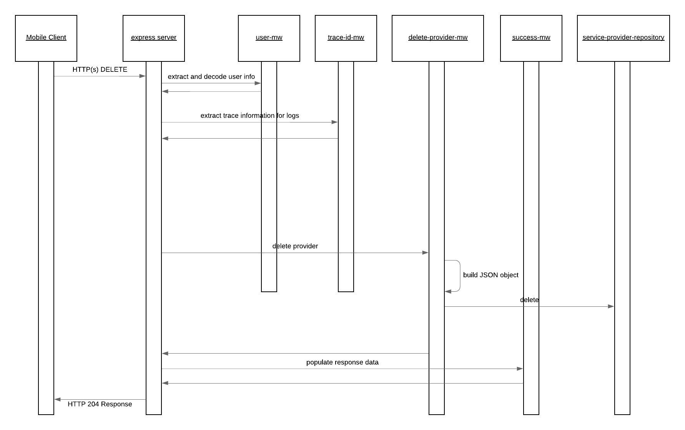
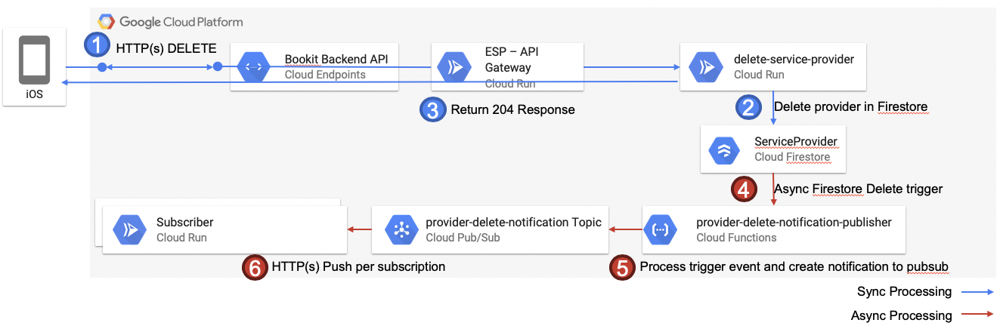

# delete-service-provider

The delete service provider service provides the capabilities to delete a service provider for a particular user from the Bookit Application.

The happy path sequence for this services DELETE request is seen in the below image. It is possible for the middleware or repositories to generate runtime exceptions in which case these are automatically captured and propagated to the user by the default configured express error MW handler. The possible error scenarios are mentioned in the component descriptions and would lead to a stop within the processing flow.

## API Description

This service exposes and HTTP(s) POST API which enables the creation of service providers.

- [Payload](./src/payload-validations.js): This defines the expected payload for this service
- [Route](./src/index.js): The route which is directly exposed by this service is defined when the express POST route is registered.
- [API Gateway Documentation](https://endpointsportal.bookit-app-260021.cloud.goog/docs/esp-fjwomrdjca-ue.a.run.app/0/routes/provider/post): The API tools provides the documentation for the API as it is exposed via Cloud Endpoints to the outside world. 

## Component Descriptions

- [delete-provider-mw](./src/delete-provider-mw.js): This is the main MW step configured for this service within the chain and it is responsible to take the payload provided by the user and map it to an object which is acceptable for the service provider repository to commit to the database.

  - Error Scenarios:
    - Update Failed Error: This is raised when an exception is generated from the repository. This would occur if there are failures with the creation of the service provider.

- [success-mw](./src/success-mw.js): If all goes well within the process and this MW step is reached it is just populating a proper HTTP response code to the caller.

## Special Processing

Deletion of service providers has some special processing which occurs after the information is deleted from the ServiceProvider collection. This is necessary to ensure services which are referencing information here can clean up any dependent data. For example, cancellation of all appointments linked to this service provider, or to disassociate the user from the Service Provider. The flow is depicted in the flow diagram below.

There may be other services in future which would be interested in such events as well. Rather than mixing the processing within the delete of the service provider it is done asynchronously and triggered based on events raised from the Cloud Firestore database as seen in the image above.

The below describes what is happening as shown in the diagram

1. User sends and HTTP(s) DELETE request to delete a service provider.
2. A delete request is sent to Cloud Firestore to remove the ServiceProvider
3. On successful deletion of the document the delete-service-provider service responds to the user with a 204 HTTP No Content response code.
4. The provider-delete-notification-publisher function is registered already within the infrastructure to the Delete firestore event trigger for the ServiceProvider collection. When the data is saved the trigger is automatically fired behind the scenes. This is not within the same roundtrip as the user request.
5. The provider-delete-notification-publisher receives the event message and generates the payload for the pubsub notification onto topic provider-delete-notification
6. Those services which are registered as subscribers of this topic will receive the event notification and perform whatever dependent processing

### Additional Github Repositories

The below repositories contain the code base and documentation for those additional components mentioned within the data flow diagram above.

- [Provider Delete Notification Publisher](https://github.com/bookit-app/provider-delete-notification-publisher)
- Subscribers:
  - [Profile Services: Provider Delete Notification Processor](https://github.com/bookit-app/profile-services/tree/master/src/services/provider-delete-notification-processor)
  - [Provider Services: Provider Delete Notification Processor](https://github.com/bookit-app/provider-services/tree/master/src/services/provider-delete-notification-processor)
  - [Calender Services: Provider Delete Notification Processor](https://github.com/bookit-app/calender-services/tree/master/src/services/provider-delete-notification-processor)
