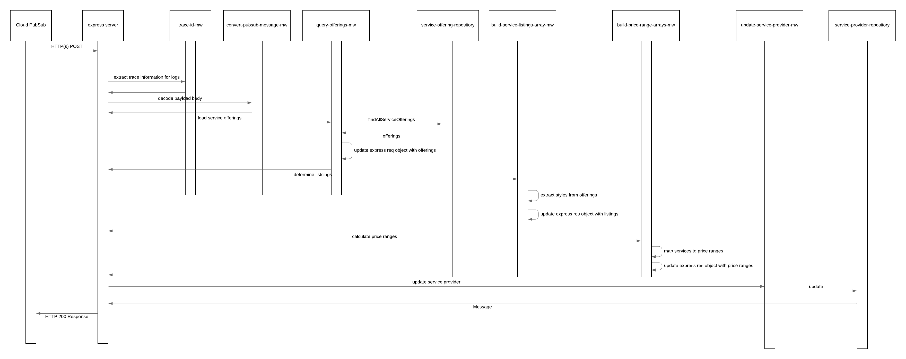

# offering-notification-processor

The offering notification processor service handles the preparation of metadata to support the [service provider search](../provider-search/README.md) based on price ranges and styles from the offerings linked to the service provider. This service subscribes to pubsub topic service-change-notification and when service offerings are created/updated/deleted it will be notified and subsequently load all the current offerings from cloud firestore and calculate and store the following data:

- **priceRanges**: Calculated based on the service offerings associated with the provider. This will contain values from $, $$, $$$, $$$$ based on the price of the offering. If at least one offering exists for a price range value it will be placed in the priceRanges array indicating that the provider offers services within the price range. The price ranges map based on the logic contain in the [provider-search-util](../../lib/util/provider-search-util.js) functions
- **styles**: Styles are populated based on those styles they provider offers.
- **serviceSpecificPriceRanges**: This holds the style specific price ranges and is calculated the same as priceRanges but within the context of a specific style.

The happy path sequence for this services POST request is seen in the below image. It is possible for the middleware or repositories to generate runtime exceptions in which case these are automatically captured and propagated by the default configured express error MW handler. As this is being invoked via a pubsub subscriptions errors will cause the message to be automatically reprocessed (by pubsub) until it is able to succeed. The possible error scenarios are mentioned in the component descriptions and would lead to a stop within the processing flow.

## API Description

This service exposes and HTTP(s) POST API which enables the processing of the events published onto the service-change-notification pubsub topic. This service does not expose any routes publicly outside of GCP and the client cannot call this function.

- [Payload](./src/payload-validations.js): This defines the expected payload for this service
- [Route](./src/index.js): The route which is directly exposed by this service is defined when the express POST route is registered.

## Component Descriptions

- [query-offerings-mw](./src/query-offerings-mw.js): This MW step is responsible to load the currently persisted service offerings from cloud firestore which are associated with the service provider.
    - Error Scenarios:
        - System Error: This is raised if the query to cloud firestore is unable to be made.

- [build-service-listing-array](./src/build-service-listing-array.js): This MW step will iterate over the loaded service offerings and build up a unique list of style ID's extracted from the full set.

- [build-price-range-arrays](./src/build-price-range-arrays.js): This MW step will iterate over the loaded service offerings and the priceRanges and serviceSpecificPriceRanges arrays

- [update-service-provider-mw](./src/update-service-provider-mw.js): This MW step is responsible to the arrays calculated an put into the res object and ask the repository to update the service provider with the details. If for some reason the service provider is deleted by the time this MW is called the exception is captured and the process is allowed to complete successfully.

  - Error Scenarios:
    - Update Failed Error: This is raised when an exception is generated from the repository. This would occur if there are failures with the creation of the service provider.

- [success-mw](./src/success-mw.js): If all goes well within the process and this MW step is reached it is just populating a proper HTTP response code to the caller.
