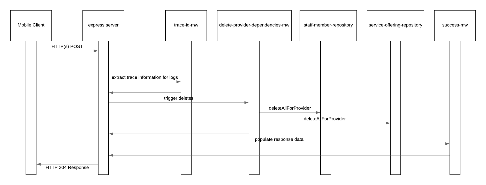

# provider-delete-notification-processor

The provider delete notification service handles the cleanup of the sub collections associated with a service provider when the service provider itself is deleted. This is necessary as Cloud Firestore doesn't automatically delete the documents contained within a sub-collection when the parent document is removed.

The happy path sequence for this services request is seen in the below image. It is possible for the middleware or repositories to generate runtime exceptions in which case these are automatically captured and propagated to the user by the default configured express error MW handler. The possible error scenarios are mentioned in the component descriptions and would lead to a stop within the processing flow.

As this service is trigger based on a push notification from Cloud PubSub if there is a failure within the service the message will automatically be retried ensuring that the information is eventually cleaned up.

## API Description

This service exposes an HTTP(s) POST API which enables the processing of the events published onto the provider-delete-notification pubsub topic. This service does not expose any routes publicly outside of GCP and the client cannot call this function.

- [Route](./src/index.js): The route which is directly exposed by this service is defined when the express POST route is registered.

## Component Descriptions

- [delete-provider-dependencies-mw](./src/delete-provider-dependencies-mw.js): This MW step triggers the deletion of the subcollections based on the repository references provided. In the case of the app at this point in time this is for the staff and offerings sub-collections.

  - Error Scenarios:
    - Update Failed Error: This is raised when an exception is generated from any of the repository instances. This would occur if there are failures with the creation of the service provider.

- [success-mw](./src/success-mw.js): If all goes well within the process and this MW step is reached it is just populating a proper HTTP response code to the caller.
