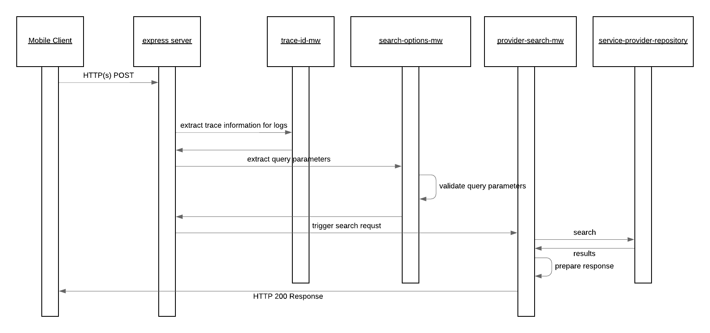

# provider-search

The provider search service provides the capabilities to search for service providers based on the following attributes:

- city
- state
- zip
- business name
- styles
- price range

When a query request is made the necessary information is evaluated and a select is generated against the ServiceProvider collection documents. The attributes for styles and price range are handled a bit specially simply because this information comes from documents contained within the offering sub-collection which are children of the documents within the ServiceProvider collection. To deal with this information specific information is replicated to arrays onto the ServiceProvider document to enable efficient queries against this single collection. Refer to the following documents for details on how this information is being replicated:

- [Create Service Offering](../create-service-offering/README.md)
- [Offering Notification Processor](../offering-notification-processor/README.md)

If the information which is intended to be replicated is not executed by the time the query runs the results will not contain those service providers. However, one the data is in place queries across all of the attributes works exactly the same with the exception of how the query is built for firestore depending on the attributes data type.

Additionally, if the user performs a query based on the Style and a Price Range the query will focus to specifically provider a responses where the ServiceProvider has that particular service within that particular price range. Otherwise price ranges are considered generally across ALL services that the provider offers.

The happy path sequence for this services GET request is seen in the below image. It is possible for the middleware or repositories to generate runtime exceptions in which case these are automatically captured and propagated to the user by the default configured express error MW handler. The possible error scenarios are mentioned in the component descriptions and would lead to a stop within the processing flow.

## API Description

This service exposes and HTTP(s) GET API which enables the creation of service providers.

- [Route](./src/index.js): The route which is directly exposed by this service is defined when the express GET route is registered.
- [API Gateway Documentation](https://endpointsportal.bookit-app-260021.cloud.goog/docs/esp-fjwomrdjca-ue.a.run.app/0/routes/search/provider/get): The API tool provides the documentation for the API as it is exposed via Cloud Endpoints to the outside world. 

## Component Descriptions

- [search-options-mw](./src/search-options-mw.js): This MW process the query parameters to ensure that they are valid supported query parameters for this search. It will iterate over the req.query array and verify against what the service provider repository supports. It will only accept that which are valid all others will be discarded

  - Error Scenarios:
    - Malformed Request Error: This is raised if none of the query parameters are supported by the search request

- [provider-search-mw](./src/provider-search-mw.js): This MW will trigger the search request based on the query parameters extracted in the search-options-mw. It makes a call to the service provider repository where the firestore query is dynamically built. Once it has the data it will prepare the response to the caller.

  - Error Scenarios:
    - System Error: This is raised if there is a failure with the connection to Cloud Firestore.