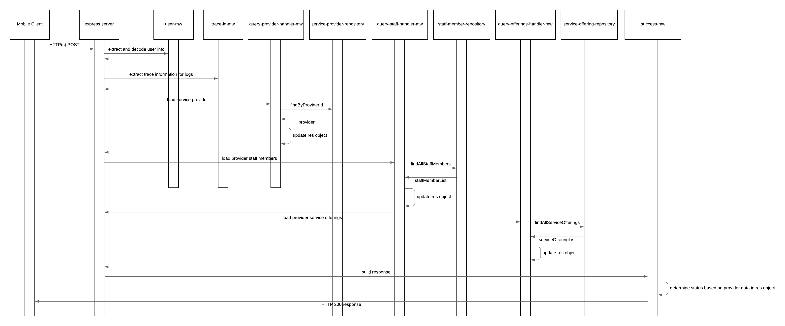

# query-service-provider

The query service provider service enables the consumer to GET a specific Service Provider by the provider ID. When this API is called the service provider repository will be invoked to query the service provider information from the ServiceProviders collection on Cloud Firestore. Along with the main data for the service provider this request will additionally load the staff member and service offering information so that all necessary details of a provider can be obtained with a single API call.

The happy path sequence for this services GET request is seen in the below image. It is possible for the middleware or repositories to generate runtime exceptions in which case these are automatically captured and propagated to the user by the default configured express error MW handler. The possible error scenarios are mentioned in the component descriptions and would lead to a stop within the processing flow.

## API Description

This service exposes and HTTP(s) POST API which enables the creation of service providers.

- [Route](./src/index.js): The route which is directly exposed by this service is defined when the express POST route is registered.
- [API Gateway Documentation](https://endpointsportal.bookit-app-260021.cloud.goog/docs/esp-fjwomrdjca-ue.a.run.app/0/routes/provider/%7BproviderId%7D/get): The API tools provides the documentation for the API as it is exposed via Cloud Endpoints to the outside world. 

## Component Descriptions

- [query-offerings-mw](./src/query-offerings-mw.js): This MW will trigger the query to the service offering repository based on the provider ID extracted from the route path. When the MW executes it looks for the existence of the res.provider object. If this doesn't exist the MW will be skipped. This is an implied check based on the sequencing of the MW chain that it expects the provider information to be loaded before it is executed.

  - Error Scenarios:
    - System Error: This is raised when an exception is generated from the repository. This would occur if there are failures with the communication to Cloud Firestore.

- [query-staff-members-mw](./src/query-staff-members-mw.js): This MW will trigger the query to the staff member repository based on the provider ID extracted from the route path. When the MW executes it looks for the existence of the res.provider object. If this doesn't exist the MW will be skipped. This is an implied check based on the sequencing of the MW chain that it expects the provider information to be loaded before it is executed.

  - Error Scenarios:
    - System Error: This is raised when an exception is generated from the repository. This would occur if there are failures with the communication to Cloud Firestore.

- [query-provider-me](./src/query-provider-mw.js): This MW will load the Service Provider information use the service provider repository from Cloud Firestore.

  - Error Scenarios:
    - System Error: This is raised when an exception is generated from the repository. This would occur if there are failures with the communication to Cloud Firestore.

- [success-mw](./src/success-mw.js): If all goes well within the process and this MW step is reached it is just populating a proper HTTP response code to the caller.