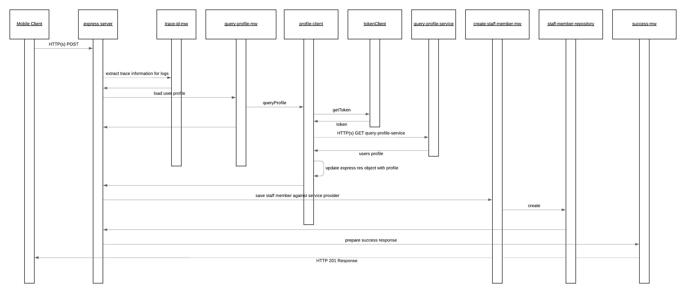

# staff-membership-accepted-notification-processor

The staff membership accepted notification processor is a service which hooks into Cloud PubSub topic staff-request-accepted-notification. The purpose of the service is to process requests that have been accepted and create a staff member and link it to the service provider.

The happy path sequence for this services request is seen in the below image. It is possible for the middleware or repositories to generate runtime exceptions in which case these are automatically captured and propagated to the user by the default configured express error MW handler. The possible error scenarios are mentioned in the component descriptions and would lead to a stop within the processing flow.

As this service is trigger based on a push notification from Cloud PubSub if there is a failure within the service the message will automatically be retried ensuring that the information is eventually cleaned up.

## API Description

This service exposes an HTTP(s) POST API which enables the processing of the events published onto the provider-delete-notification pubsub topic. This service does not expose any routes publicly outside of GCP and the client cannot call this function.

- [Route](./src/index.js): The route which is directly exposed by this service is defined when the express POST route is registered.

## Component Descriptions

- [create-staff-member-mw](./src/create-staff-member-mw.js): This MW triggers that actual creation of the staff member into CLoud Firestore via the staff-member-repository.

  - Error Scenarios:
    - Update Failed Error: This is raised when an exception is generated from any of the repository instances. This would occur if there are failures with the creation of the service provider.

- [query-profile-mw](./src/query-profile-mw.js): This MW triggers the query of the Staff Members provider leverage the Profile Client.

  - Error Scenarios:
    - Update Failed Error: This is raised when an exception is generated from the Profile Client meaning the profile could not be loaded for the staff member.

- [success-mw](./src/success-mw.js): If all goes well within the process and this MW step is reached it is just populating a proper HTTP response code to the caller.

- [client](./src/client): Contains the necessary objects to connect to the profile service to load the users profile. There is a token client which will obtain a JWT token for the services service account to ensure that the service-to-service calls can be authenticate and go through. 