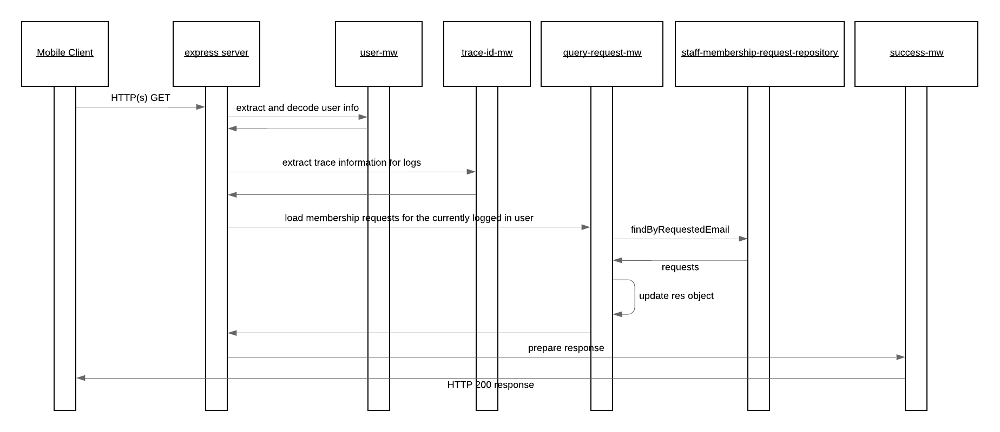

# staff-membership-request-query

The staff membership request query service provides an API to GET staff membership requests which are link with the currently logged in user.

The happy path sequence for this services PUT request is seen in the below image. It is possible for the middleware or repositories to generate runtime exceptions in which case these are automatically captured and propagated to the user by the default configured express error MW handler. The possible error scenarios are mentioned in the component descriptions and would lead to a stop within the processing flow.

## API Description

This service exposes and HTTP(s) POST API which enables the creation of service providers.

- [Route](./src/index.js): The route which is directly exposed by this service is defined when the express POST route is registered.
- [API Gateway Documentation](https://endpointsportal.bookit-app-260021.cloud.goog/docs/esp-fjwomrdjca-ue.a.run.app/0/routes/staffMembershipRequest/get): The API tools provides the documentation for the API as it is exposed via Cloud Endpoints to the outside world. 

## Component Descriptions

- [query-request-mw](./src/query-request-mw.js): This MW will trigger the query to Cloud Firestore based on the currently logged in user.

  - Error Scenarios:
    - System Error: This is raised if there are issues connecting to Cloud Firestore

- [success-mw](./src/success-mw.js): If all goes well within the process and this MW step is reached it is just populating a proper HTTP response code to the caller.