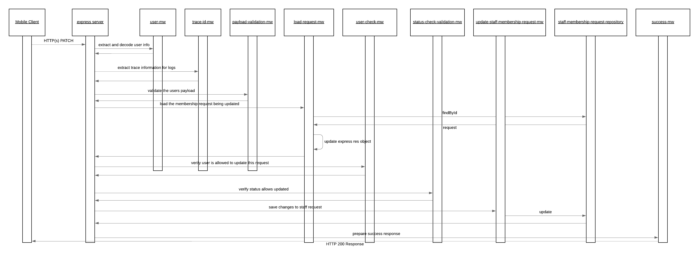
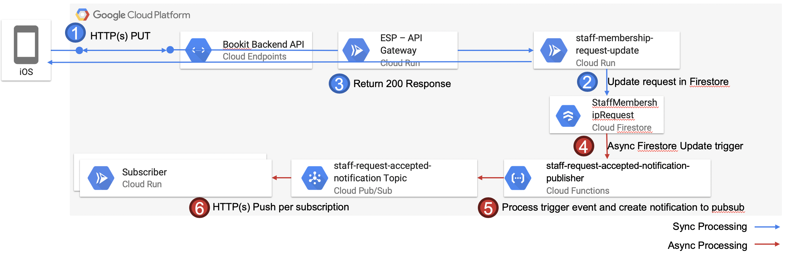

# staff-membership-request-update

The staff membership request update service enables changes to the PUT against an existing staff membership request. This is intended to allow the recipient of the request to provider a response.

The happy path sequence for this services PUT request is seen in the below image. It is possible for the middleware or repositories to generate runtime exceptions in which case these are automatically captured and propagated to the user by the default configured express error MW handler. The possible error scenarios are mentioned in the component descriptions and would lead to a stop within the processing flow.

## API Description

This service exposes and HTTP(s) POST API which enables the creation of service providers.

- [Payload](./src/payload-validations.js): This defines the expected payload for this service
- [Route](./src/index.js): The route which is directly exposed by this service is defined when the express POST route is registered.
- [API Gateway Documentation](https://endpointsportal.bookit-app-260021.cloud.goog/docs/esp-fjwomrdjca-ue.a.run.app/0/routes/staffMembershipRequest/%7BrequestId%7D/patch): The API tools provides the documentation for the API as it is exposed via Cloud Endpoints to the outside world. 

## Component Descriptions

- [load-request-mw](./src/load-request-mw.js): This MW will load the staff membership request from cloud firestore and place it into the res object for processing within the remain MW steps in the route chain.

  - Error Scenarios:
    - Not Found: This is raised if the staff membership request is not known
    - Update Failed: This is raised if there are issues with the update to Cloud Firestore

- [payload-validations](./src/payload-validations.js): This defines the schema which is expected for the body of the payload and some check functions to ensure the provided data is appropriate.

  - Error Scenarios:
    - Malformed Error: When the provided payload is not valid per the schema defined. This could occur if the JSON content on the body is malformed or the EIN code provided already exists against a ServiceProvider record

- [status-check-validation-mw](./src/status-check-validation-mw.js): This MW validates that the staff membership request is in the proper status allowing for edits.

  - Error Scenarios:
    - Malformed Request Error: This is raised if the request is not in the proper status

- [update-staff-membership-request-mw](./src/update-staff-membership-request-mw.js): This MW will trigger the update of the Staff Membership Request by consuming the staff-membership-request-repository.

  - Error Scenarios:
    - Update Failed: This is raised if there are issues with the update to Cloud Firestore

- [user-check-mw](./src/user-check-mw/js): This MW verifies that the Staff Membership Request is linked to the currently logged in user.

    - Error Scenarios:
        - Forbidden: If the current user is not linked with the request they are not allowed to modify it

- [success-mw](./src/success-mw.js): If all goes well within the process and this MW step is reached it is just populating a proper HTTP response code to the caller.

## Special Processing

Changes to staff membership requests has some special processing which occurs after the information is updated within the StaffMembershipRequests collection. The flow is depicted in the flow diagram below.

When a staff membership request is changed cloud firestore will trigger notifications based on the UPDATE trigger so that registered functions and handle the necessary background operations.

### Additional Github Repositories

The below repositories contain the code base and documentation for those additional components mentioned within the data flow diagram above.

- [staff-request-accepted-notification-publisher](https://github.com/bookit-app/staff-request-accepted-notification-publisher)

- Subscribers:
  - [staff-membership-accepted-notification-processor](../staff-membership-accepted-notification-processor/README.md)