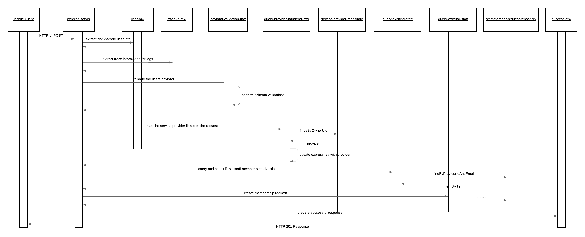

# staff-membership-request

The staff membership request service provides enables the owner user of a service provider to make a request for a user (existing bookit user or not) to become part of the staff associated with the service provider. When a membership request is created it is created into the StaffMembershipRequest collection.

The happy path sequence for this services POST request is seen in the below image. It is possible for the middleware or repositories to generate runtime exceptions in which case these are automatically captured and propagated to the user by the default configured express error MW handler. The possible error scenarios are mentioned in the component descriptions and would lead to a stop within the processing flow.

## API Description

This service exposes and HTTP(s) POST API which enables the creation of service providers.

- [Payload](./src/payload-validations.js): This defines the expected payload for this service
- [Route](./src/index.js): The route which is directly exposed by this service is defined when the express POST route is registered.
- [API Gateway Documentation](https://endpointsportal.bookit-app-260021.cloud.goog/docs/esp-fjwomrdjca-ue.a.run.app/0/routes/staffMembershipRequest/post): The API tools provides the documentation for the API as it is exposed via Cloud Endpoints to the outside world. 

## Component Descriptions

- [query-existing-staff](./src/query-existing-staff.js): This MW step validates that the email provided with the request is not already associated with a staff member of the service provider linked with the currently logged in user.

  - Error Scenarios:
    - Malformed Request Error: This is raised if there already exists a staff member with the provided email
    - System Error: This is raised if there are issues with the connection to Cloud Firestore

- [payload-validations](./src/payload-validations.js): This defines the schema which is expected for the body of the payload and some check functions to ensure the provided data is appropriate.

  - Error Scenarios:
    - Malformed Error: When the provided payload is not valid per the schema defined. This could occur if the JSON content on the body is malformed or the EIN code provided already exists against a ServiceProvider record

- [query-provider-mw](./src/query-provider-mw.js): This MW loads the provider that is associated with the currently logged in user.

  - Error Scenarios:
    - Malformed Request Error: This is raised there is no service provider for the current user
    - System Error: This is raised if there are issues with the connection to Cloud Firestore

- [create-staff-membership-request](./src/create-staff-membership-request.js): This MW will trigger the creation of the Staff Membership Request by consuming the staff-membership-request-repository. It will also populate the location header in the response.

  - Error Scenarios:
    - System Error: This is raised if there are issues with the connection to Cloud Firestore

- [success-mw](./src/success-mw.js): If all goes well within the process and this MW step is reached it is just populating a proper HTTP response code to the caller.