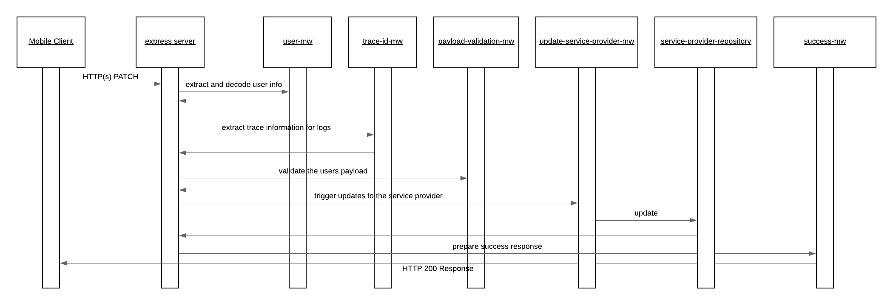

# update-service-provider

The update service provider allows the service provider to be modified if the owner needs to adjust something.

The happy path sequence for this services POST request is seen in the below image. It is possible for the middleware or repositories to generate runtime exceptions in which case these are automatically captured and propagated to the user by the default configured express error MW handler. The possible error scenarios are mentioned in the component descriptions and would lead to a stop within the processing flow.

## API Description

This service exposes and HTTP(s) POST API which enables the creation of service providers.

- [Payload](./src/payload-validations.js): This defines the expected payload for this service
- [Route](./src/index.js): The route which is directly exposed by this service is defined when the express POST route is registered.
- [API Gateway Documentation](https://endpointsportal.bookit-app-260021.cloud.goog/docs/esp-fjwomrdjca-ue.a.run.app/0/routes/provider/%7BproviderId%7D/services/%7BserviceId%7D/patch): The API tools provides the documentation for the API as it is exposed via Cloud Endpoints to the outside world. 

## Component Descriptions

- [update-service-provider-mw](./src/update-service-provider-mw.js): This MW triggers the update to Cloud Firestore vai the service provider repository.

  - Error Scenarios:
    - Update Failed Error: This is raised when an exception is generated from the repository. This would occur if there are failures with the update of the service provider.

- [payload-validations](./src/payload-validations.js): This defines the schema which is expected for the body of the payload and some check functions to ensure the provided data is appropriate.

  - Error Scenarios:
    - Malformed Error: When the provided payload is not valid per the schema defined. This could occur if the JSON content on the body is malformed or the EIN code provided already exists against a ServiceProvider record

- [success-mw](./src/success-mw.js): If all goes well within the process and this MW step is reached it is just populating a proper HTTP response code to the caller.